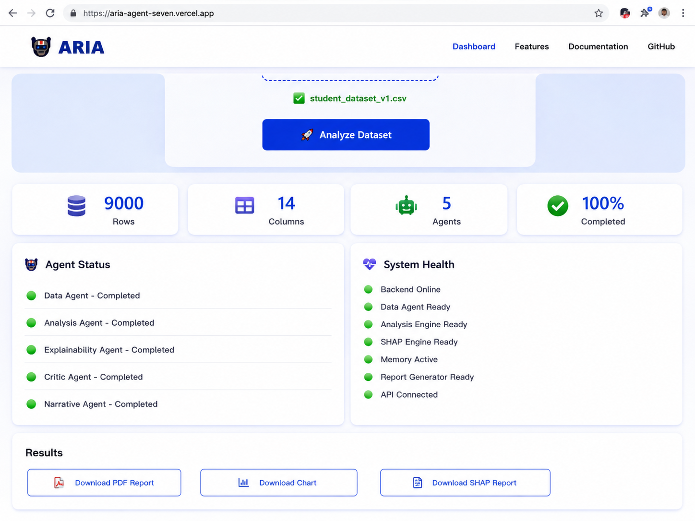

# 🤖 ARIA — Autonomous Research & Intelligence Agent

> An autonomous multi-agent AI platform that transforms raw datasets into machine learning insights, explainable results, critical evaluation, and executive-ready reports.


## 🚀 Overview

ARIA (Autonomous Research & Intelligence Agent) is a multi-agent AI system designed to automate the end-to-end data science workflow.

Instead of manually exploring datasets, selecting machine learning models, generating explanations, checking model reliability, and preparing reports, ARIA coordinates multiple specialized agents to perform these tasks automatically.

### The goal

**Upload a dataset → ARIA analyzes it → explains the results → evaluates reliability → generates a report.**

---

## 🖥️ ARIA in Action



*ARIA's web interface showing automated multi-agent dataset analysis.*

## ✨ Key Features

- 📊 Automated dataset understanding
- 🤖 Automated machine learning model selection
- 📈 Classification and regression analysis
- 🔍 Feature importance and explainability
- 🧠 Multi-agent AI workflow
- 🛡️ Critical evaluation of model results
- 📝 Automated executive-style reports
- 📉 Automatic chart generation
- 💾 Persistent agent memory
- 🌐 Web-based interface
- 📄 PDF report generation

---

## 🧩 Multi-Agent Architecture

ARIA uses specialized agents for different stages of the data science workflow.

| Agent | Responsibility |
|---|---|
| 📊 Data Agent | Understands and preprocesses the dataset |
| 🧮 Analysis Agent | Selects and evaluates machine learning models |
| 🔍 Explainability Agent | Identifies important features and explains predictions |
| 🛡️ Critic Agent | Checks reliability, risks and potential issues |
| 📝 Report Agent | Converts results into an executive-ready report |

Additional research and memory components support the overall workflow.

---

## 🔄 How ARIA Works

```text
                ┌─────────────────┐
                │ Upload Data │
                └────────┬────────┘
                         ↓
                ┌─────────────────┐
                │ Data Agent │
                └────────┬────────┘
                         ↓
                ┌─────────────────┐
                │ Analysis Agent │
                └────────┬────────┘
                         ↓
              ┌──────────┴──────────┐
              ↓ ↓
      Explainability Agent Critic Agent
              │ │
              └──────────┬──────────┘
                         ↓
                ┌─────────────────┐
                │ Report Agent │
                └────────┬────────┘
                         ↓
                ┌─────────────────┐
                │ Insights + PDF │
                └─────────────────┘
